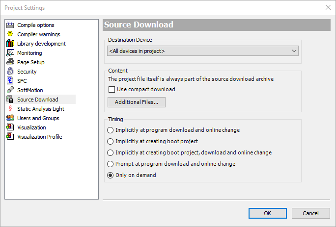

# FAQ
####Jaká je výchozí IP adresa procesorové jednotky?
> V továrním nastavení získává jednotka IP adresu z DHCP serveru. Adresa tedy bude odvislá od parametrů vaší sítě.
> Postup jak změnit nastavení síťového rozhraní najdete v sekci: [Nastavení](../nastaveni/wbm).

####Jaké jsou výchozí přihlašovací údaje?
> Rozlišujeme přihlašovací údaje pro vstup do Web-Based Management (resp. Console-Based Management) a pro nahrání programu. Ve výchozím nastavení je pro obojí použito přihlašovací jméno `admin` a heslo `wago`.
> Pro zvýšení bezpečnosti doporučujeme výchozí hesla změnit - postup najdete v sekci: [Nastavení](../nastaveni/wbm).

####Jaký port používá CODESYS ke spojení s procesorovým modulem?

####Projekt po restartu jednotky zmizí.
> Standardně se program při stažení do jednotky uloží pouze do paměti typu RAM, která se při restartu vymaže. Zkopírování do flash paměti provedete příkazem v Source Download to Connected Device v menu Online v CODESYS. To je potřeba provést ručně, případně změnit nastavení CODESYS v menu Project - Project Settings - Source Donwload. 

