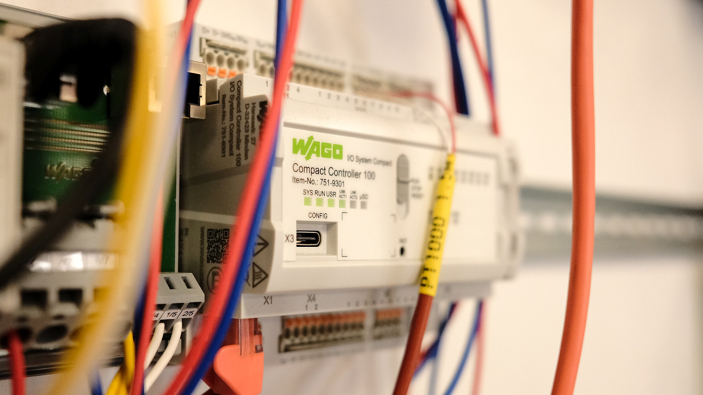

# Úvod

-   :material-devices:{ .lg .middle } __Hardware__

    ---

    Přehled zařízení pro vaše projekty
      
    [:octicons-arrow-right-24: Hardware](../hardware/plc)

-   :material-cog:{ .lg .middle } __Konfigurace__

    ---

    Úvodní oživení, síťové nastavení, update firmware, atd.
     
    [:octicons-arrow-right-24: Konfigurace jednotek](../nastaveni/wbm)

-   :fontawesome-solid-laptop-code:{ .lg .middle } __Programování__

    ---

    Průvodce prvními kroky v prostředí CODESYS V3.5
     
    [:octicons-arrow-right-24: Programování](../instalace)

-   :material-frequently-asked-questions:{ .lg .middle } __FAQ__

    ---

    Odpovědi na nejčastější dotazy
      
    [:octicons-arrow-right-24: FAQ](../faq)

