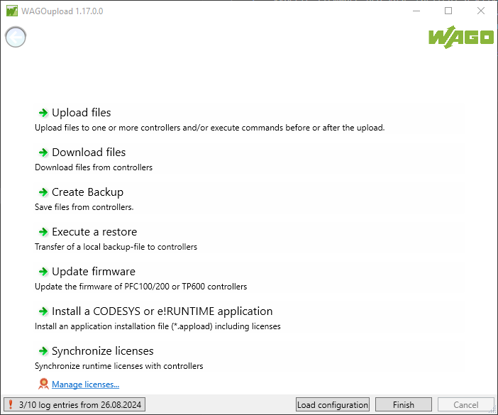
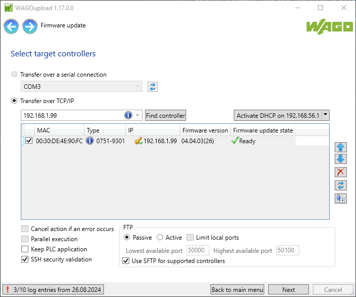
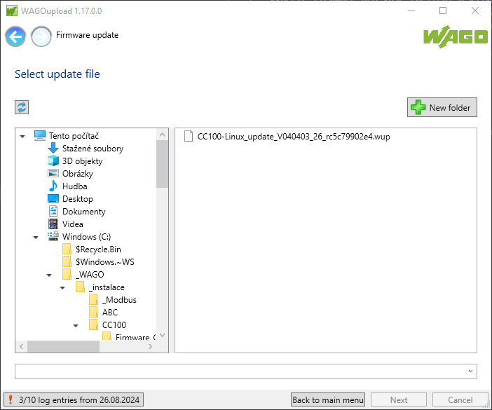
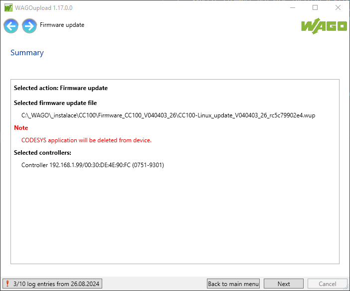

#Update firmware

##Stažení firmware
1.  Navštivte [WAGO Download Center](https://downloadcenter.wago.com/software) a přejděte do sekce Firmware. 
2.  Vyberte firmware pro vaše zařízení a klikněte na ikonu.
3.  V dalším okně klikněte na tlačítko Download.
4.  Potvrďte podmínky pro stažení a klikněte na Download. Soubory se uloží do vašeho počítače.

Pro update přes síť budete dále potřebovat nástroj WAGOUpload. Ten můžete stáhnout také z [WAGO Download Center](https://downloadcenter.wago.com/software) tentokrát v sekci Applications.
##Update přes síť
1.  Rozbalte stažený archiv s firmware.
2.  Spusťte nástroj WAGOUpload.
3.  Klikněte na volbu Update firmware.
    
4.  Vyplňte IP adresu jednotky nebo klikněte na Find controller. V tabulce vyberte jednotku pro update a stiskněte Next.
    
5.  Vyberte soubor firmware s příponou *.wup.
    
6.  Potvrďte update. 
    
7.  Zobrazí se okno s informacemi o průběhu aktualizace. Proces trvá cca 10 minut a během toho se PLC restartuje.

##Update přes paměťovou kartu
Budete potřebovat paměťovou kartu SD, resp. uSD - podle typu procesorové jednotky. 

1.  Naformátujte paměťovou kartu na souborový systém FAT32. Lze provést i přímo v jednotce přes Web-based Management v sekci Configuration - Mass Storage - Create new Filesystem on Memory Card.
2.  Rozbalte stažený archiv s firmware.
3.  Nakopírujte soubor s příponou *.img na paměťovou kartu. Lze použít například nástroj [Rufus](https://rufus.ie/) nebo [Etcher](https://etcher.balena.io/).
4.  Vložte paměťovou kartu do PLC a restartujte ho.
5.  Jednotka nabootuje firmware z paměťové karty.
6.  Otevřete Web-based Management a přejděte do sekce Configuration - Administration - Create Image.
7.  Ověřte, že u položky Boot device je uvedeno Memory Card, u Destination je Internal Flash. Stiskněte tlačítko Start Copy.
8.  Po dokončení kopírování vypněte PLC, vytáhněte paměťovou kartu a znovu zapněte. Jednotka nabootuje nový firmware z interní paměti.