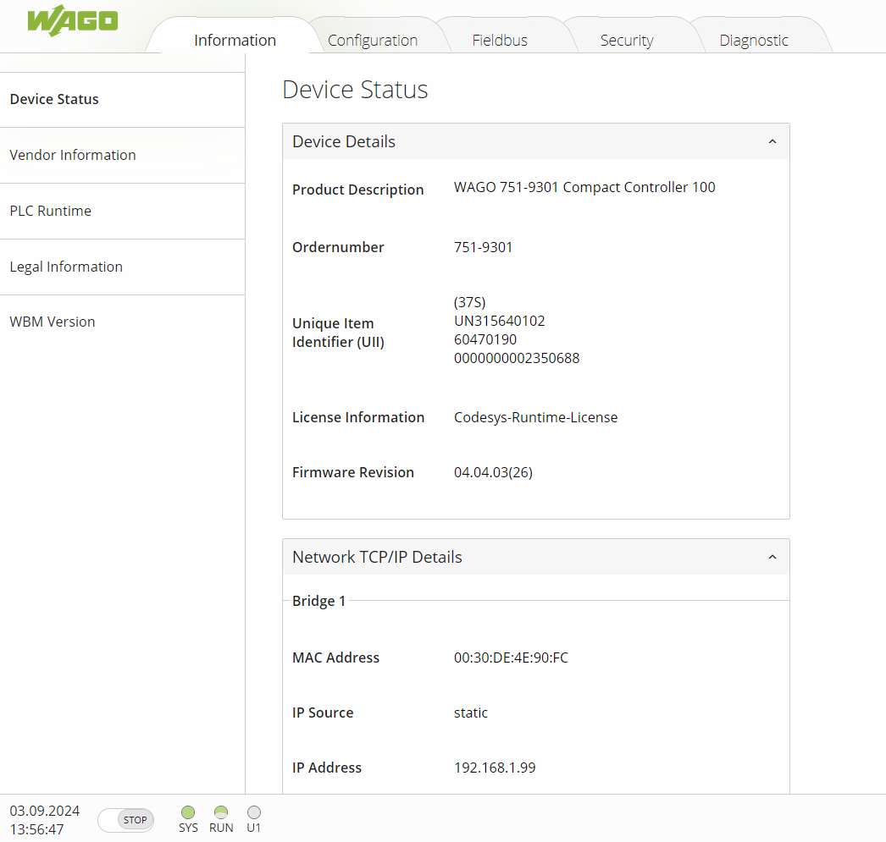
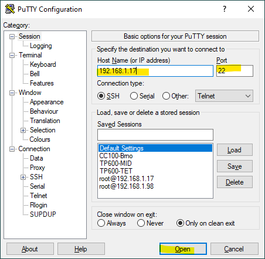
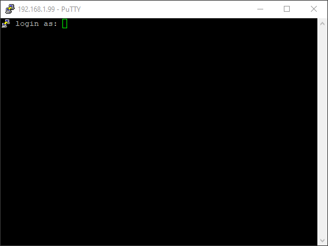
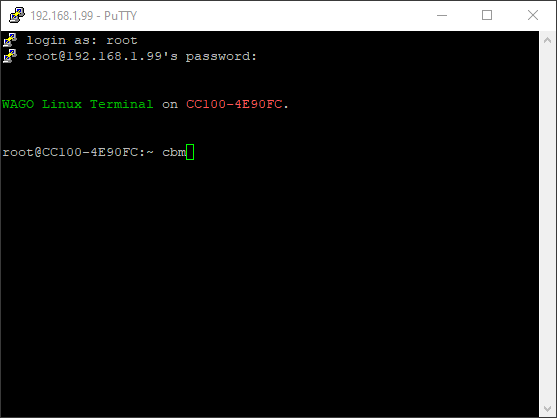

#Konfigurace jednotky
##Web-based Management
Jedná se o webové rozhraní pro konfiguraci, které běží na vlastním webserveru PLC. Umožňuje kompletní nastavení jednotky včetně změny IP adres, portů, protokolů, zabezpečení nebo aktualizace firmware. Je dostupné přes internetový prohlížeč po zadání adresy `https://<IP-adresa-PLC>/wbm`. 
Výchozí přihlašovací údaje jsou `admin` a `wago`.

1.	Otevřete webový prohlížeč
2.	Zadejte IP adresu vaší procesorové jednotky a /wbm (např. `192.168.1.17/wbm`)
3.	Přihlaste se jako uživatel `admin`  (výchozí heslo: `wago`)
    

!!! danger "Změna hesla"

    Z důvodu snadného zneužití je výrazně doporučeno změnit výchozí přihlašovací údaje. To lze provést v sekci Configuration - Users.

##Console-based Management
Ekvivalent webového rozhraní dostupný přes konzoli - například s využitím SSH klienta PuTTy <https://www.putty.org/>.

1.  Spusťte PuTTy. Zadejte IP adresu PLC do pole Hostnema. Ověřte číslo portu. Connection type nastavte na SSH. Poté klikněte na Open.
    
2.  Při první připojení se zobrazí dotaz na povolení spojení.
3.  Můžete se přilhásit jako uživatel `admin` nebo `root`, výchozí heslo je v obou případech `wago`.
    
4.  Po úspěšném přihlášení spusťte konfigurační rozhraní příkazem `cbm` a potvrďte klávesou enter. 

    

5.  Pro pohyb v menu a použijte zobrazené klávesy.
!!! warning "SSH server a root login"

    Ve výchozím nastavení je povolena služba SSH serveru i přilhášení jako root. Obojí lze vypnout přes WBM v sekci Configuration - Ports and Services - SSH.

##Nastavení IP adresy
###
###Dočasné nastavení pevné IP adresy

Tuto proceduru lze využít, pokud neznáte stávající IP adresu a nemáte k dispozici servisní kabel.

1.	Propojte Váš počítač a procesorovou jednotku Ethernetovým kabelem a nastavte mu adresu z rozsahu `192.168.1.x`
2.	Přepínač režimu nastavte do polohy `STOP`
3.	Zmáčkněte tlačítko `RESET` a držte jej déle jak 8 sekund
4.	LED SYS začne blikat oranžově a jednotka bude mít dočasně nastavenou pevnou IP adresu `192.168.1.17`
5.	Nyní můžete využít Web-based Management pro konfiguraci jednotky a trvalou změnu IP adresy
6.	Po restartování jednotky je toto dočasné nastavení zapomenuto

##Výběr runtime, zapnutí webvisu, vypnutí přihlašování v Codesys

